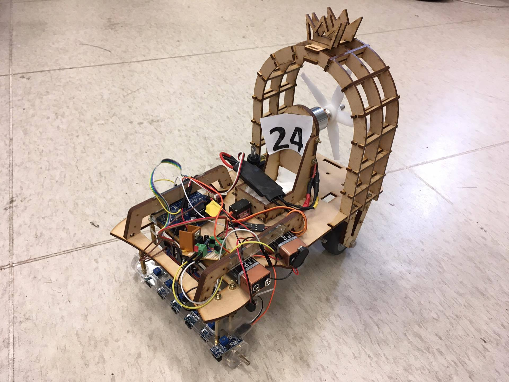
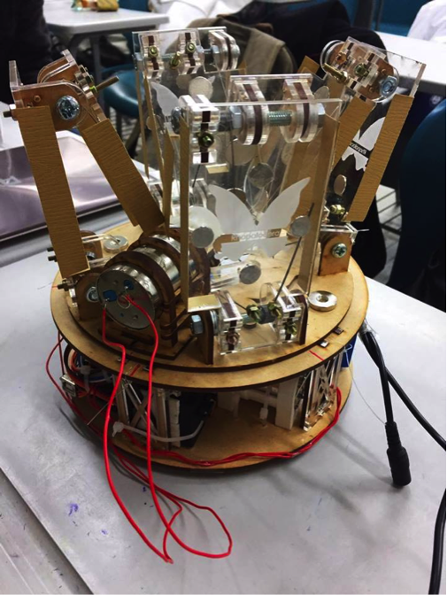
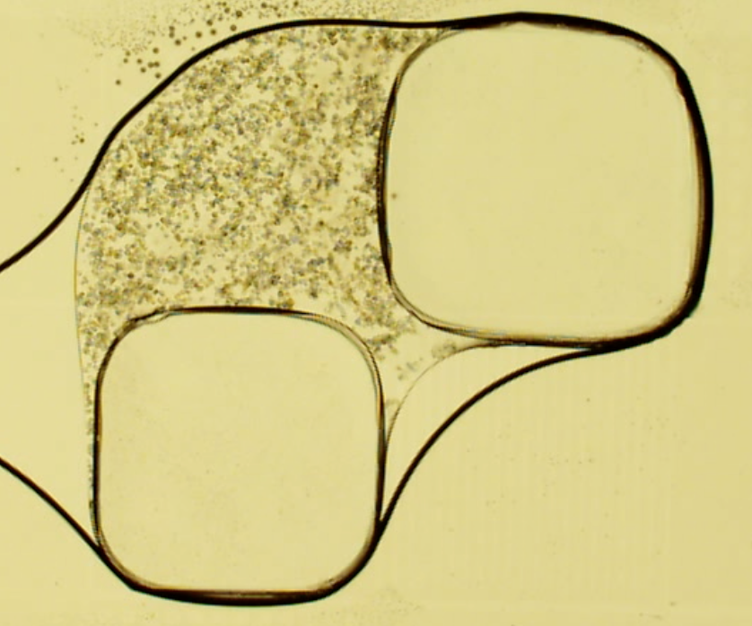
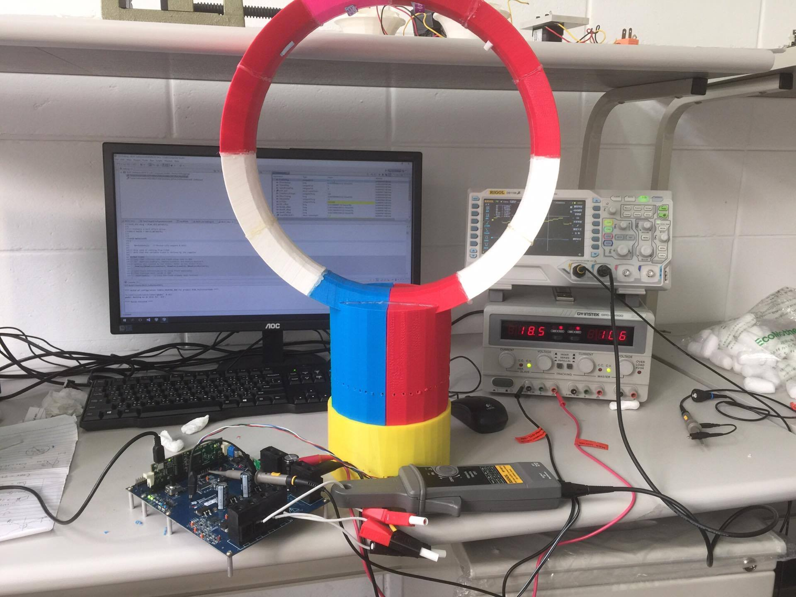

# Bachelor-School-Projects
## Introduction
記錄一些大學校內參與的專題、實作等

### 氣動車 (2017)
大三機械工程實務

### 爬竿機器人 (2016)
大三機械設計原理

### 微流體控制 (2016)
大三專題（范士岡教授實驗室）

### 無扇葉風扇 (2016)
大二專題（楊士進教授實驗室）

### 陽春投石機 (2015)
大一機械工程概論

